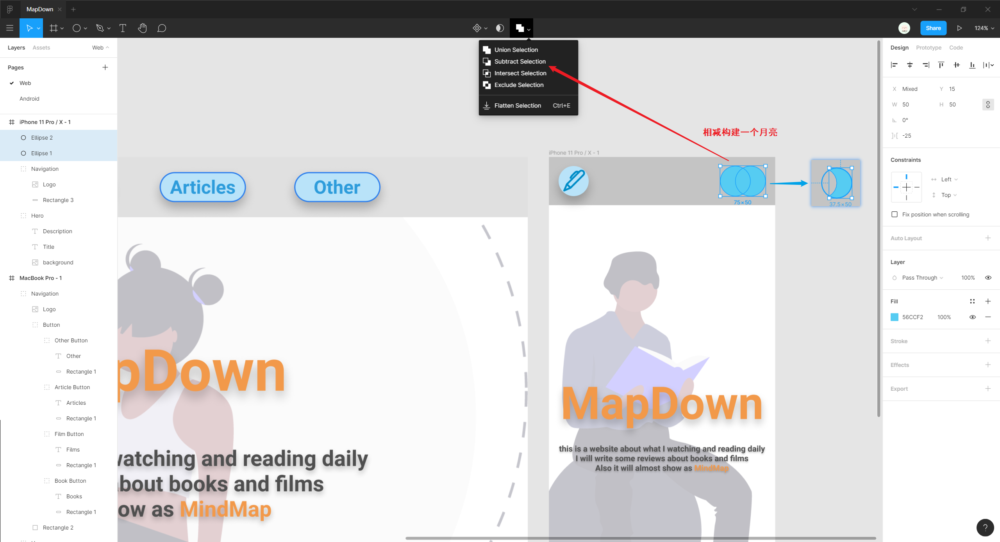

# 形状与图标

## 形状组合

基本的形状通过简单的布尔运算 Booleans 可以构建出复杂的精致图标。

常见的布尔运算包括：

* **组合 `Union`**：将多个形状合并在一起，如当你将三行线结合得到一个汉堡菜单。

* **相减 `Subtract`**：从主图形（即重叠形状的最底部图形）中减去一个图形或多个图形。

  :warning: 所有图形都是为了从主形状中减去相应的形状。

* **现交 `Intersect`**：显示出 2 个图形相遇的空间。
* **排除 `Exclude`**：显示 2 个图形不相交的空间。

## 扁平图层

使用具有多个形状的布尔构建的图标具有复杂的多层，可以进行扁平处理 `Flatten Selection` 将图标简化为只有一个图层的形状，方便进行其他操作。

<iframe style="width: 100%;aspect-ratio: 16/9;" src="//player.bilibili.com/player.html?aid=94259627&bvid=BV1sE411p7br&cid=162048824&page=20&high_quality=1&danmaku=0" allowfullscreen="true" loading="lazy"></iframe>

:bulb: 扁平选择图层的快捷键：`Ctrl + E`

## 常用图标

* 关闭图标

  <iframe style="width: 100%;aspect-ratio: 16/9;" src="//player.bilibili.com/player.html?aid=94259627&bvid=BV1sE411p7br&cid=162048858&page=21&high_quality=1&danmaku=0" allowfullscreen="true" loading="lazy"></iframe>

* 齿轮图标 COG

  <iframe style="width: 100%;aspect-ratio: 16/9;" src="//player.bilibili.com/player.html?aid=94259627&bvid=BV1sE411p7br&cid=162048880&page=22&high_quality=1&danmaku=0" allowfullscreen="true" loading="lazy"></iframe>

* 播放图标

  <iframe style="width: 100%;aspect-ratio: 16/9;" src="//player.bilibili.com/player.html?aid=94259627&bvid=BV1sE411p7br&cid=162048913&page=23&high_quality=1&danmaku=0" allowfullscreen="true" loading="lazy"></iframe>

* 箭头图标

  <iframe style="width: 100%;aspect-ratio: 16/9;" src="//player.bilibili.com/player.html?aid=94259627&bvid=BV1sE411p7br&cid=162048920&page=24&high_quality=1&danmaku=0" allowfullscreen="true" loading="lazy"></iframe>
