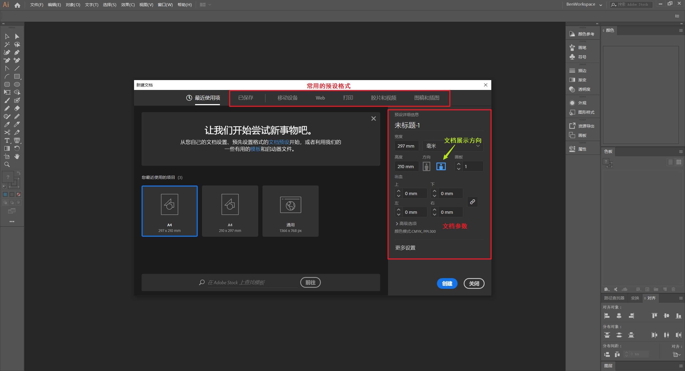
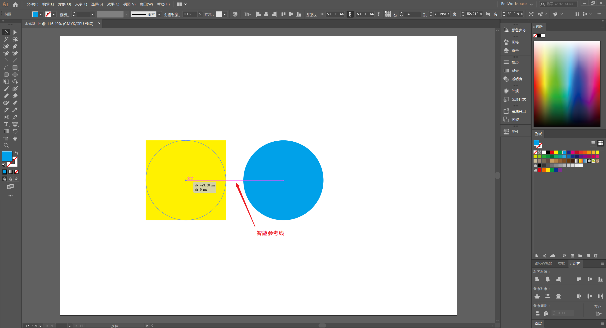
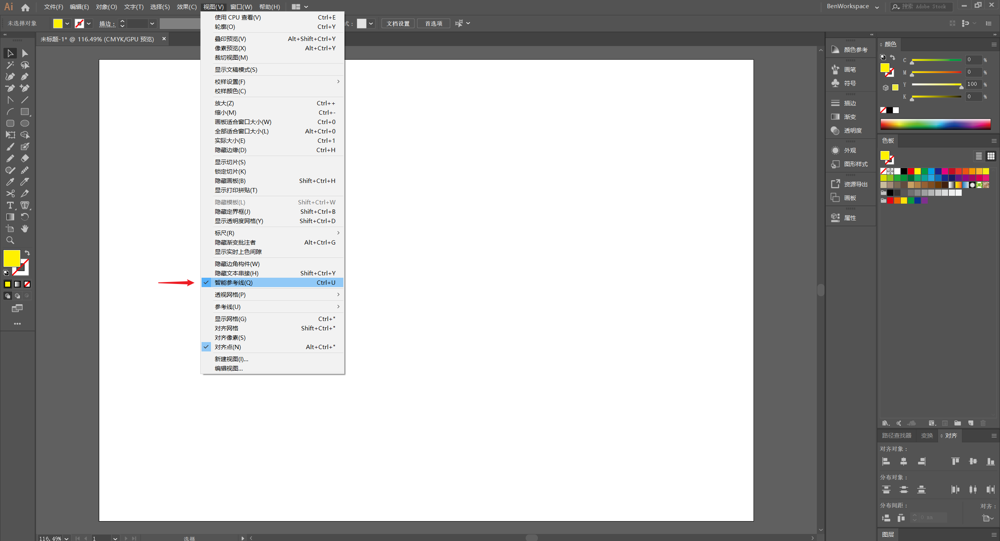
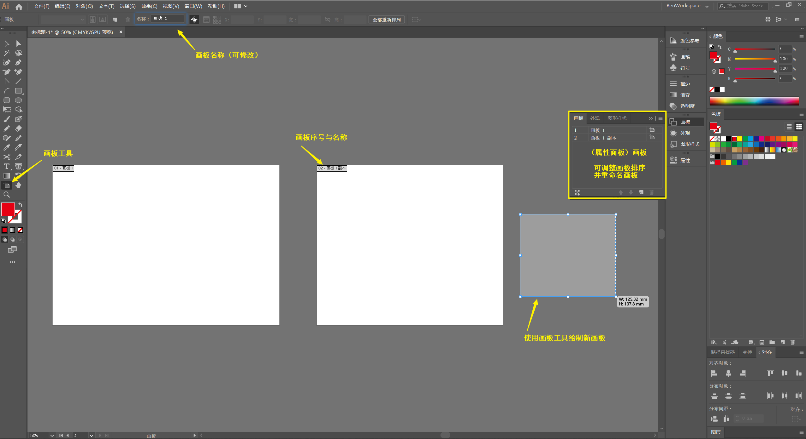
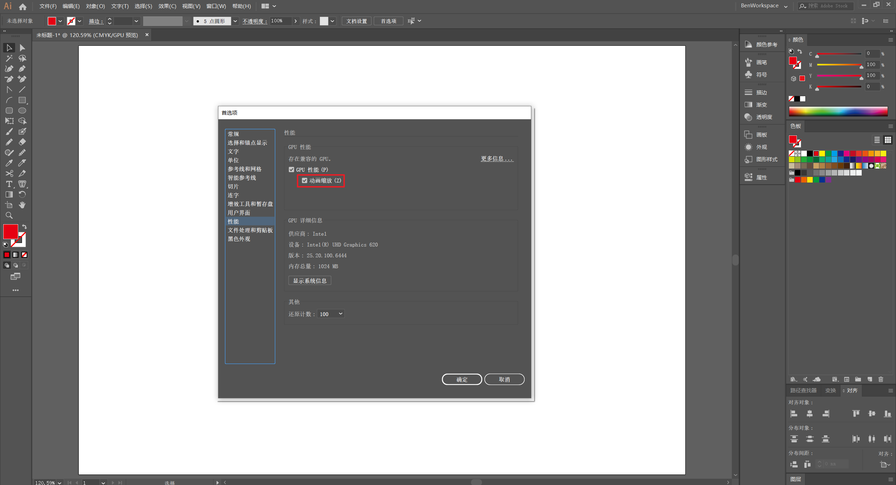
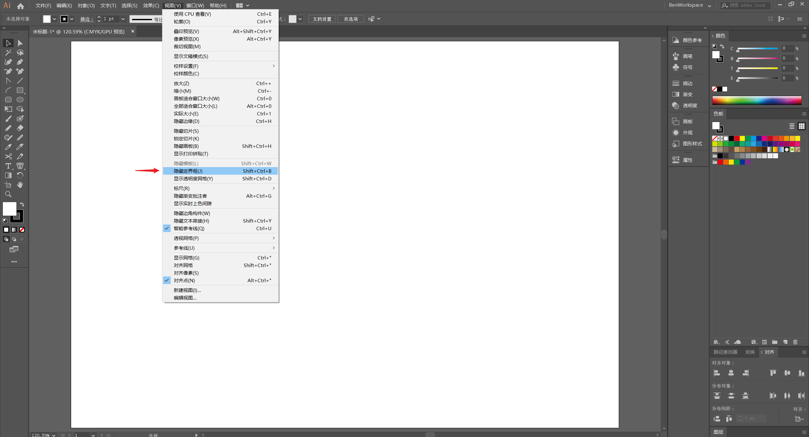
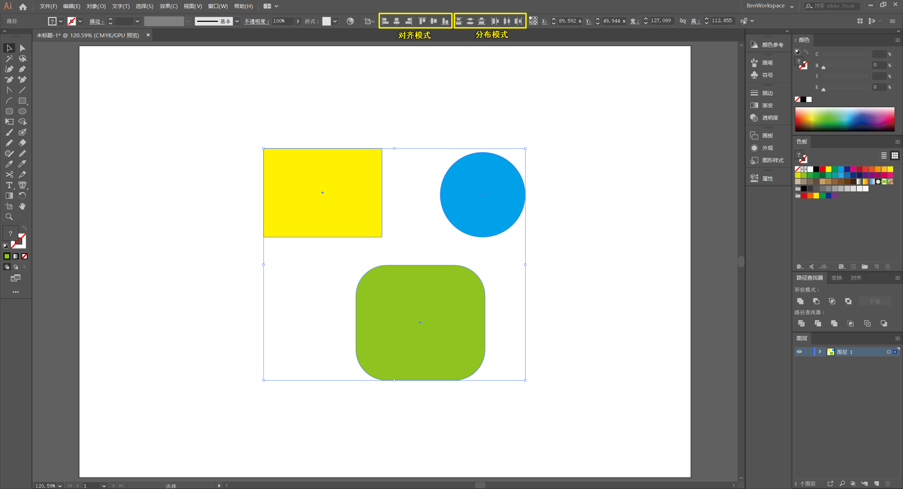
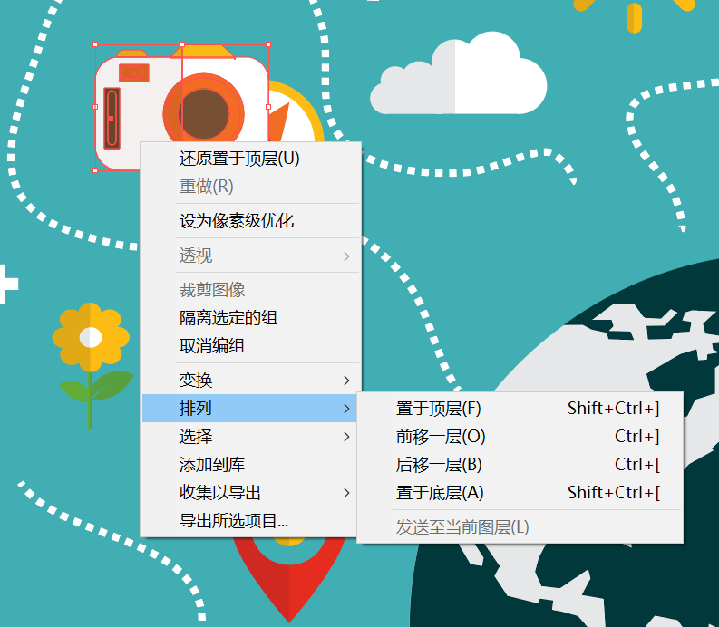

# 基础操作

常用工具的基本使用方法。

## 快捷键

:point_right: 更多快捷键参考 Adobe 提供的[速查表](https://helpx.adobe.com/cn/illustrator/using/default-keyboard-shortcuts.html)。

## 新建文档

可以根据所需创建特定画板大小的文件，也可以选择常见的预设空文档或模板。

:bulb: 新建文档快捷键：`Ctrl + N`

## 移动

:bulb: 移动工具快捷键：`V`

### 智能参考线

对象在移动时会出现 **紫色** 的线，称为是智能参考线，用以辅助对齐定位。

* 开启/关闭智能参考线： （菜单栏）`视图` -> `智能参考线`

  :bulb: 开启/关闭智能参考线快捷键：`Ctrl + U`

### 移动复制

通过复制一个副本的形式进行对象移动。

:bulb: 移动复制：移动对象时按住 `Alt` 键

## 画板

画板相当于一个专门的页面，可单独保存或导出这个画板上的文件。在一个文档中可以使用 `画板工具` 创建多个画板，以便在同一个文档中存储项目相关的所有设计，如 Logo、Banner、leaflet、business card 等。

:bulb: 画板工具快捷键：`Shift + O`

<iframe style="width: 100%;aspect-ratio: 16/9;" src="//player.bilibili.com/player.html?aid=92256512&page=11&high_quality=1&danmaku=0" allowfullscreen="true" loading="lazy"></iframe>

* 调整画板大小：

  :key: 方法一：使用`画板工具`调整画板四周的锚点

  :key: 方法二：在（选项栏）输入宽高 `w` 和 `H` 数值

  :key: 方法三：使用（选项栏）预设画板

<iframe style="width: 100%;aspect-ratio: 16/9;" src="//player.bilibili.com/player.html?aid=92256512&cid=157515112&page=10&high_quality=1&danmaku=0" allowfullscreen="true" loading="lazy"></iframe>

* 修改画板名称：

  :key: 方法一：在选项栏修改画板名称

  :key: 方法二：在（属性面板）`画板` 双击画板名称进行修改

* 调整画板顺序：在（属性面板）`画板` 中拖拽以更改画板的顺序（导出时可能需要使用该序号）

### 复制画板

<iframe style="width: 100%;aspect-ratio: 16/9;" src="//player.bilibili.com/player.html?aid=92256512&cid=157514923&page=1&high_quality=1&danmaku=0" allowfullscreen="true" loading="lazy"></iframe>

* 以复制副本的方式移动画板：移动画板时按住 `Alt` 键

:warning: 如果希望同时拷贝画板上的图稿，需要激活（选项栏）`移动/复制带画板的图稿`

### 导出画板

可以选择性保存或导出单个/多个画板。

<iframe style="width: 100%;aspect-ratio: 16/9;" src="//player.bilibili.com/player.html?aid=92256512&cid=157515044&page=5&high_quality=1&danmaku=0" allowfullscreen="true" loading="lazy"></iframe>

### 删除画板

<iframe style="width: 100%;aspect-ratio: 16/9;" src="//player.bilibili.com/player.html?aid=92256512&cid=157515032&page=4&high_quality=1&danmaku=0" allowfullscreen="true" loading="lazy"></iframe>

:bulb: 删除画板快捷键：（选择相应的画板）`Delete` 键，

:warning: 删除画板时，不会删除画板上的图稿

## 导航

对画板进行缩放和移动的操作。

### 缩放

:bulb: 缩放工具快捷键：`Z`
#### 任意缩放

<iframe style="width: 100%;aspect-ratio: 16/9;" src="//player.bilibili.com/player.html?aid=92256512&cid=157515252&page=19&high_quality=1&danmaku=0" allowfullscreen="true" loading="lazy"></iframe>

:key: 方法一 ：使用 `缩放工具` 通过点击画板进行任意梯度的缩放（默认是放大，按住 `Alt` 键再点击则为缩小）

:key: 方法二：按住 `Alt` 键，滚动 🖱️ 鼠标滑轮进行任意梯度的缩放

:key: 方法三：使用 `缩放工具` 时按住 🖱️ 鼠标向右拖动放大，向左拖动缩小（无级缩放）

:warning: 要实现无级缩放需要开启`动画缩放`（否则只能进行框选放大，或按住 `Alt` 键框选缩小），开启步骤：（菜单栏）`编辑` -> `首选项` -> `性能` 。

:bulb: （基于画板中央）缩放快捷键：`Ctrl` + `+` 放大，`Ctrl` + `-` 缩小

#### 特定缩放

<iframe style="width: 100%;aspect-ratio: 16/9;" src="//player.bilibili.com/player.html?aid=92256512&cid=157515269&page=20&high_quality=1&danmaku=0" allowfullscreen="true" loading="lazy"></iframe>

<iframe style="width: 100%;aspect-ratio: 16/9;" src="//player.bilibili.com/player.html?aid=92256512&cid=157515269&page=20&high_quality=1&danmaku=0" allowfullscreen="true" loading="lazy"></iframe>

将当前画板缩放至适应窗口：单击（属性面板）`画板` 中特定的画板名称

:bulb: 将当前画板缩放至适应窗口快捷键：`Ctrl + 0`

:bulb: 将所有画板缩放至适应窗口快捷键：`Ctrl + Alt + 0`

### 移动

使用 `抓手工具` 可以左右拖动视图

:bulb: 抓手工具快捷键：按住 `Space`

## 选择

常用的两种选择工具

* `选择工具` 用于选择形状整体，选中的形状其边框会突出显示。用以调整尺寸、旋转形状等。
* `直接选择工具` 用于选择形状的具体锚点，重新调整形状结构。

:bulb: 选择工具的快捷键：`v`

:bulb: 直接选择工具的快捷键：`A`

:bulb: 取消所有选择的快捷键：`Ctrl + Shift + A`

<iframe style="width: 100%;aspect-ratio: 16/9;" src="//player.bilibili.com/player.html?aid=92256512&cid=157515152&page=13&high_quality=1&danmaku=0" allowfullscreen="true" loading="lazy"></iframe>

:warning: 为了可以使用 `选择工具` 对形状进行调整，需要打开定界框，以显式对象四周的锚点

:key:（菜单栏）`视图` -> `显示定界框`

### 选择多个元素

:key: 方法一：使用 `选择工具` 或 `直接选择工具` 框选多个形状或锚点

:key: 方法二：使用 `选择工具` 或 `直接选择工具`  同时按住 `Shift` 键点选多个形状或锚点

:key: 方法三：使用 `套索工具` 圈选多个形状或锚点（当框选形状的部分，然后使用 `直接选择工具` 移动进行操作）

:bulb: 若需要取消其中的一些已选择元素，可以按住 `Shift` 键后点选形状或锚点取消选中

:bulb: 取消所有选择的快捷键：`Ctrl + Shift + A`

* 通过反向选择当前选中元素余下的元素（整个文件内，包括其他画布的元素）：（菜单栏）`选择` -> `反向`

### 锁定元素

通过锁定元素，如背景，避免操作过程中被误选中。

:key: 方法一：（菜单栏）`对象` -> `锁定` -> `所选对象`

:key: 方法二：（属性面板）`图层` 点击元素所在图层单击眼睛图标后方进行锁定

:bell: 若图层过多，可在选定元素后，点击（属性面板）`图层` 下方的搜索按钮 :mag_right: 快速定位

<iframe style="width: 100%;aspect-ratio: 16/9;" src="//player.bilibili.com/player.html?aid=92256512&cid=157515088&page=8&high_quality=1&danmaku=0" allowfullscreen="true" loading="lazy"></iframe>

:bulb: 锁定选中元素的快捷键：`Ctrl + 2`

:bulb: 全部解锁的快捷键：`Alt + Ctrl + 2`

## 对齐与分布
选择（多个）对象后，选项栏会出现对齐（和分布模式）的可视化按钮。

* 对齐模式依次为：水平左对齐、水平居中对齐、水平右对齐、垂直顶对齐、垂直居中对齐、垂直底对齐

* 分布模式依次为：垂直顶分布、垂直居中分布、垂直底分布、水平左分布、水平居中分布、水平右分布

在（属性面板）`对齐` 中进行更详细的对齐与分布设置，如设置对齐的参考系：

* 对齐所选对象
* 对齐关键对象（可以设置间距），如果选择了对齐关键对象后，关键对象会显示为深蓝色，如果需要更改参考对象，此时可以点击画布中任一选中的对象将其作为关键对象。
* 对齐画板

<iframe style="width: 100%;aspect-ratio: 16/9;" src="//player.bilibili.com/player.html?aid=92256512&cid=157515293&page=21&high_quality=1&danmaku=0" allowfullscreen="true" loading="lazy"></iframe>

## 元素排列

元素的排列是指其**在其图层中**叠放的先后次序

:key: 方法一：选中元素后点击鼠标右键 -> `排列` 选择需要调整的排列方式

:bulb: 置于顶层的快捷键 `Shift + Ctrl + ]`

:bulb: 前移一层的快捷键 `Ctrl + ]`

:bulb: 后移一层的快捷键 `Ctrl + [`

:bulb: 置于底层的快捷键 `Shift + Ctrl + [`

:key: 方法二：在（属性面板）手动拖拽元素（分组）调整它在图层中的相对顺序

<iframe style="width: 100%;aspect-ratio: 16/9;" src="//player.bilibili.com/player.html?aid=92256512&bvid=BV1S7411N7WV&cid=220777547&page=23&high_quality=1&danmaku=0" allowfullscreen="true" loading="lazy"></iframe>

